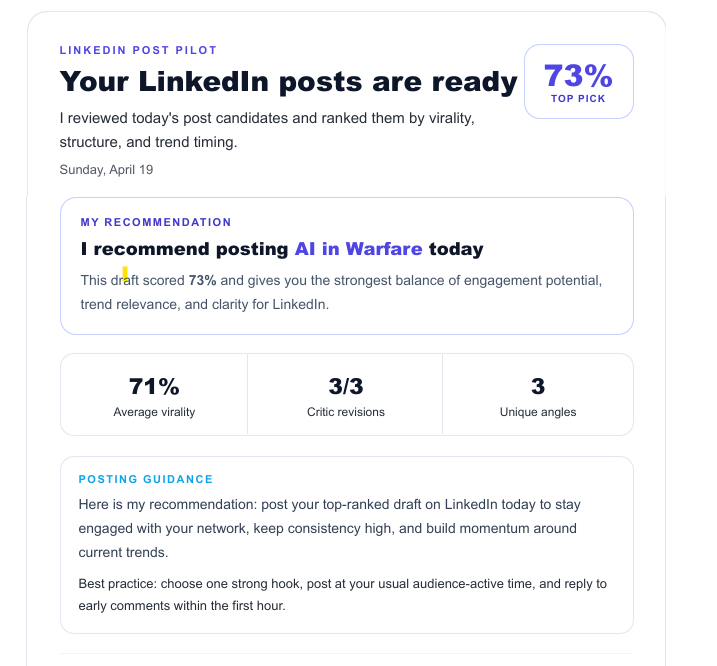
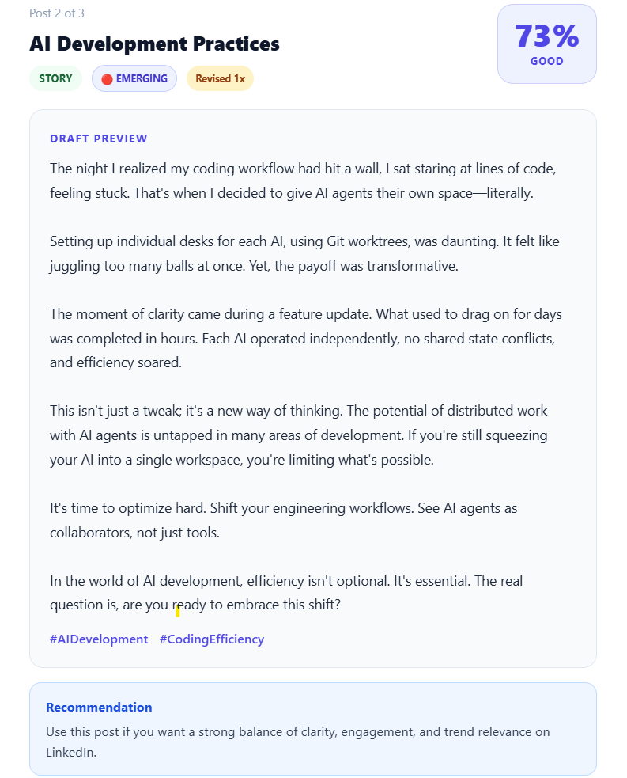
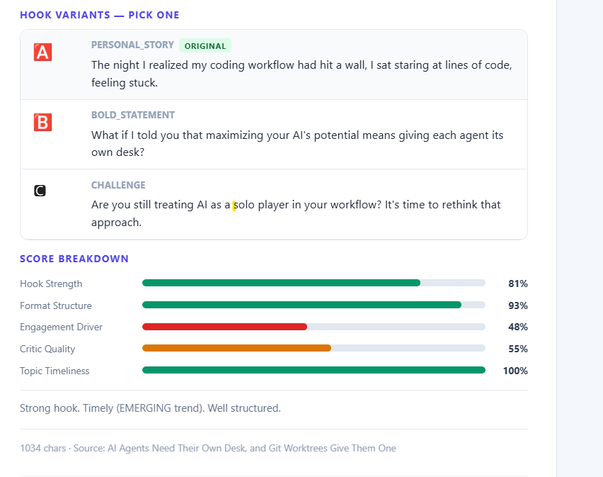

<p align="center">
  <h1 align="center">Viral Ink</h1>
  <p align="center">
    <strong>Self-improving AI agent that writes LinkedIn posts in YOUR voice — <br>and gets smarter from your results.</strong>
  </p>
  <p align="center">
    <a href="#quick-start">Quick Start</a> •
    <a href="#how-it-works">How It Works</a> •
    <a href="#commands">Commands</a> •
    <a href="#the-feedback-loop">Feedback Loop</a> •
    <a href="docs/">Docs</a>
  </p>
  <p align="center">
    
    
    
    
  </p>
</p>

---

> **Most LinkedIn AI tools sound like ChatGPT wearing a suit.**
> This one sounds like YOU — and improves every week.

Every morning, Viral Ink scans 150+ sources, detects emerging trends, generates posts through a **3-agent debate**, scores them for virality, and delivers everything to your inbox — ranked, scored, and ready to publish.



## Why this exists

| What others do | What Viral Ink does |
|---|---|
| Generate generic posts | Matches YOUR voice with **Persona DNA** fingerprinting |
| One-shot generation | **3-agent debate**: Researcher → Writer → Critic → Revision |
| Write about whatever | **Trend radar** detects EMERGING topics before they peak |
| One hook, take it or leave it | **3 hook variants** per post — different persuasion techniques |
| "Here's your post, good luck" | **Virality scoring** (0-100%) with transparent 5-signal breakdown |
| No learning | **Self-improving** — tracks real performance and recalibrates weekly |

## What you get every morning



Every email includes:

🔴 **Trend Radar** — Which topics are EMERGING right now, before everyone else posts about them

📊 **Virality Scores** — Each post scored 0-100% across hook strength, format, engagement potential, critic quality, and topic timeliness

🅰🅱🅲 **Hook Variants** — 3 different opening hooks per post (contrarian, question, personal story, statistic, bold statement) — pick the one that fits



📈 **Score Breakdown** — Transparent scoring so you know exactly WHY a post scored the way it did

```
Hook Strength     ████████████████░░░░  78%
Format Structure  █████████████████░░░  88%
Engagement Driver ██████████░░░░░░░░░░  52%
Critic Quality    ███████████░░░░░░░░░  55%
Topic Timeliness  ████████████████████  100%
```

## How it works

```
EVERY MORNING AT 7 AM

  ┌─────────────────────────────────────────────────────────┐
  │  Step 1: Collect 150+ articles from RSS, news, research │
  │  Step 2: Rank by recency, relevance, source weight      │
  │  Step 3: Trend Radar — detect EMERGING vs SATURATED     │
  │  Step 4: Multi-Agent Generation                         │
  │          Researcher → picks best angles                 │
  │          Writer → drafts with your Persona DNA          │
  │          Critic → tears it apart (catches AI clichés)   │
  │          Revision → fixes every issue                   │
  │  Step 5: Generate 3 hook variants per post              │
  │  Step 6: Score virality (0-100%) across 5 signals       │
  │  Step 7: Deliver via email, sorted by score             │
  └─────────────────────────────────────────────────────────┘

THE FEEDBACK LOOP (gets smarter over time)

  You publish a post → Record metrics after 48h
  → Agent compares predicted vs actual performance
  → Recalibrates scoring weights
  → Updates persona preferences (strong/weak angles)
  → Learns which hook techniques your audience prefers
  → Next generation is measurably better
```

## Quick start

```bash
# Clone
git clone https://github.com/Sohamp2809/viral-ink.git
cd viral-ink

# Configure (add your OpenAI or Anthropic key)
cp .env.example .env

# Install
pip install -e .

# Teach the agent your voice (paste 3-10 of your LinkedIn posts)
pilot onboard -f my_posts.txt

# Generate your first posts
pilot run -n 5
```

### With Docker

```bash
cp .env.example .env
docker compose up
```

### With email delivery

```bash
# Add to .env:
# SMTP_HOST=smtp.gmail.com
# SMTP_PORT=587
# SMTP_USER=you@gmail.com
# SMTP_PASSWORD=your_app_password
# EMAIL_TO=you@gmail.com

pilot run -n 5 --email
```

## Persona DNA

Most AI content sounds the same because it ignores how YOU write. Persona DNA fixes this.

During onboarding, the agent analyzes your posts and extracts **12 voice dimensions**:

```yaml
tone:
  formality: 0.35        # casual ←→ formal
  assertiveness: 0.80     # strong opinions, no hedging
  humor_frequency: 0.10   # minimal — serious and substantive
  vulnerability: 0.60     # willing to share failures

structure:
  avg_post_length: 950    # characters
  uses_emojis: false      # never
  uses_single_word_lines: true   # for emphasis

vocabulary:
  avoided_words: [synergy, leverage, game-changer, paradigm]
```

These dimensions get converted to natural language rules injected into every generation call. The result: posts that match your voice at your best.

Run `pilot calibrate` to test the match — aim for 70%+.

**→ [Full Persona DNA documentation](docs/PERSONA_DNA.md)**

## Commands

### Daily workflow

| Command | What it does |
|---------|-------------|
| `pilot run` | Full pipeline: collect → trend → generate → score → display |
| `pilot run -n 5 --email` | Generate 5 posts and send via email |
| `pilot run -n 3 --preview` | Generate 3 posts and preview email in browser |
| `pilot schedule --hour 5 --tz America/Phoenix` | Auto-run daily at 5 AM |

### Setup

| Command | What it does |
|---------|-------------|
| `pilot onboard -f posts.txt` | Analyze your posts and build Persona DNA |
| `pilot calibrate` | Test if generated posts match your voice |
| `pilot collect` | Just collect and rank content (no generation) |

### Feedback loop

| Command | What it does |
|---------|-------------|
| `pilot select 3 --hook B` | Mark post #3 as published (queues 48h autopsy) |
| `pilot autopsy 3 -r 500 -c 30` | Record actual LinkedIn performance |
| `pilot learn` | Run full feedback loop (recalibrate everything) |
| `pilot analyze` | Deep pattern analysis across all your data |
| `pilot digest` | Weekly performance summary |

## The feedback loop

This is what makes Viral Ink different from every other tool. It **learns from your results**.

```
Week 1:  pilot run → publish → pilot autopsy → pilot learn
Week 2:  Agent adjusts scoring weights based on real data
Week 4:  Agent knows your strong angles (hot_take: 82%) vs weak (tutorial: 41%)
Week 8:  Prediction accuracy reaches 85%+ — agent knows what works for YOUR audience
```

After 5+ autopsy reports, `pilot learn` updates:

- **Scoring weights** — If topic timeliness predicts engagement better than hook strength, its weight increases automatically
- **Persona DNA** — Discovers your strong angles and weak angles from actual performance
- **Hook preferences** — Learns which persuasion techniques (contrarian, question, statistic) your audience responds to
- **Content memory** — Remembers which topics performed well and avoids repeating underperformers

**→ [Full Autopsy documentation](docs/AUTOPSY.md)**

## Virality scoring

Every post gets a transparent **0-100% virality prediction** from 5 independent signals:

| Signal | Weight | What it measures |
|--------|--------|-----------------|
| Hook Strength | 20% | Opening line quality — technique, specificity, emotional pull |
| Format Structure | 15% | Post length, paragraph density, readability |
| Engagement Driver | 15% | CTA quality, shareability, comment potential |
| Critic Quality | 30% | LLM critic's holistic assessment (7 dimensions) |
| Topic Timeliness | 20% | Trend radar momentum — EMERGING topics score highest |

No black boxes. Every score includes a full breakdown and reasoning.

**→ [Full Scoring documentation](docs/SCORING.md)**

## Adding a content source

Every source is a plugin. Implement one method:

```python
from src.collectors.base import BaseCollector, ContentItem

class RedditCollector(BaseCollector):
    @property
    def name(self) -> str:
        return "Reddit"

    async def collect(self) -> list[ContentItem]:
        # Your logic here
        return [ContentItem(title="...", summary="...", url="...")]
```

Add it to the collectors list in `src/main.py`. Done.

Ideas for new collectors: Reddit, Twitter/X, Product Hunt, arXiv, Substack, Medium, Dev.to.

## Project structure

```
src/
├── cli.py                    # All CLI commands
├── main.py                   # Pipeline orchestrator
├── collectors/               # Content sources (pluggable)
│   ├── base.py               # BaseCollector interface
│   ├── rss_collector.py      # RSS/Atom feeds
│   ├── news_collector.py     # NewsAPI.org
│   └── trend_radar/          # Trend prediction system
│       ├── momentum.py       # Velocity + acceleration algorithm
│       ├── tracker.py        # Topic extraction + trend computation
│       └── snapshots.py      # Persistence between runs
├── generator/                # Multi-agent content generation
│   ├── orchestrator.py       # Pipeline: researcher → writer → critic → revision → hooks → score
│   ├── agents/
│   │   ├── researcher.py     # Picks best content angles
│   │   ├── writer.py         # Drafts + revises posts
│   │   └── critic.py         # Catches AI clichés, weak hooks, fabricated stats
│   └── prompts/              # Engineered prompts (treat as code)
├── persona/                  # Voice fingerprinting
│   ├── analyzer.py           # Extract 12 voice dimensions
│   ├── prompt_injector.py    # Convert profile → natural language rules
│   └── calibrator.py        # Validate voice match
├── hooks/                    # A/B hook variant generation
│   ├── classifier.py         # Identify persuasion technique
│   └── generator.py          # Generate alternative hooks
├── scorer/                   # Virality scoring engine
│   ├── engine.py             # 5-signal weighted scorer
│   ├── hook_scorer.py        # Rule-based hook evaluation
│   ├── format_scorer.py      # Structure analysis
│   └── engagement_scorer.py  # CTA + shareability scoring
├── delivery/                 # Email + scheduling
│   ├── email_builder.py      # HTML email template
│   ├── sender.py             # Resend API / Gmail SMTP
│   ├── scheduler.py          # Daily cron with APScheduler
│   └── tracker.py            # Post selection tracking
├── autopsy/                  # Self-improving feedback loop
│   ├── report_builder.py     # Predicted vs actual analysis
│   ├── analyzer.py           # Deep pattern detection
│   ├── calibrator.py         # Auto-tune scoring weights
│   ├── persona_updater.py    # Refine voice preferences
│   ├── memory_updater.py     # Topic performance tracking
│   ├── hook_learner.py       # Hook technique preference learning
│   ├── scheduler.py          # 48h autopsy reminder queue
│   └── digest_builder.py     # Weekly performance summary
└── utils/
    ├── config.py             # Settings + YAML loading
    ├── llm.py                # LLM abstraction (OpenAI / Anthropic / Ollama)
    └── db.py                 # SQLAlchemy async models
```

## Sample personas

Not sure how to configure your voice? Start with one of these:

| Persona | Style | Best for |
|---------|-------|----------|
| [AI Engineer](data/sample_personas/ai_engineer.yaml) | Technical, opinionated, data-heavy | ML/AI practitioners |
| [Product Manager](data/sample_personas/product_manager.yaml) | Story-driven, user-focused | PMs, founders |
| [Startup Founder](data/sample_personas/startup_founder.yaml) | Raw, vulnerable, short paragraphs | Entrepreneurs |

Copy any to `config/persona_dna.yaml` and customize.

## Configuration

All config is human-readable YAML in `config/`:

| File | Purpose |
|------|---------|
| `sources.yaml` | RSS feeds, news queries, target topics |
| `persona_dna.yaml` | Your voice fingerprint + sample posts |
| `angles.yaml` | Content angle taxonomy (hot take, story, tutorial...) |
| `scoring_weights.yaml` | Auto-tuned virality signal weights |

**→ [Full Customization guide](docs/CUSTOMIZATION.md)**

## LLM support

Switch providers with one line in `.env`:

| Provider | Config | Cost |
|----------|--------|------|
| **OpenAI** | `LLM_PROVIDER=openai` | ~$15-25/month |
| **Anthropic** | `LLM_PROVIDER=anthropic` | ~$15-25/month |
| **Ollama** (local) | `LLM_PROVIDER=ollama` | **$0** |

Mix providers for cost optimization: GPT-4o for writing, GPT-4o-mini for analysis.

## Roadmap

- [x] Persona DNA voice fingerprinting
- [x] Multi-agent pipeline (researcher → writer → critic → revision)
- [x] Trend prediction radar with momentum scoring
- [x] A/B hook variants (3 per post)
- [x] 5-signal virality scoring engine
- [x] Email delivery with HTML template
- [x] Daily scheduler
- [x] Post autopsy + self-improving feedback loop
- [ ] LinkedIn viral post collector
- [ ] Content memory graph with topic suppression
- [ ] Full deduplication + summarization pipeline
- [ ] One-click publish to LinkedIn via API
- [ ] Web dashboard for analytics

## Contributing

We welcome contributions! The easiest way to start is [adding a new content source](#adding-a-content-source).

See [CONTRIBUTING.md](CONTRIBUTING.md) for guidelines.

## License

MIT — use it however you want. See [LICENSE](LICENSE).

---

<p align="center">
  <strong>Built with obsessive attention to writing quality.</strong><br>
  <em>Because your LinkedIn shouldn't sound like everyone else's.</em>
</p>
